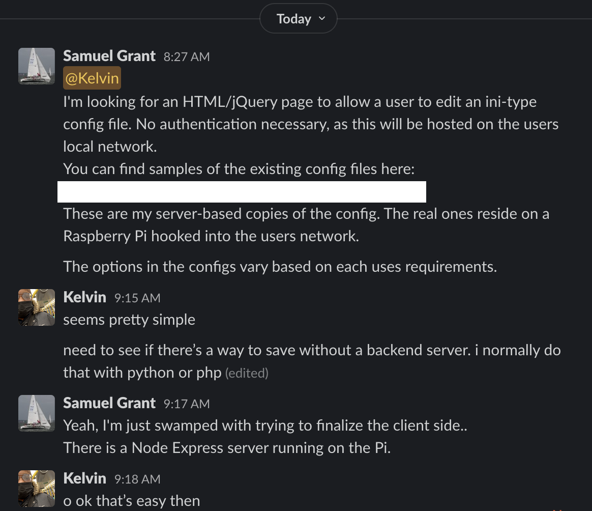
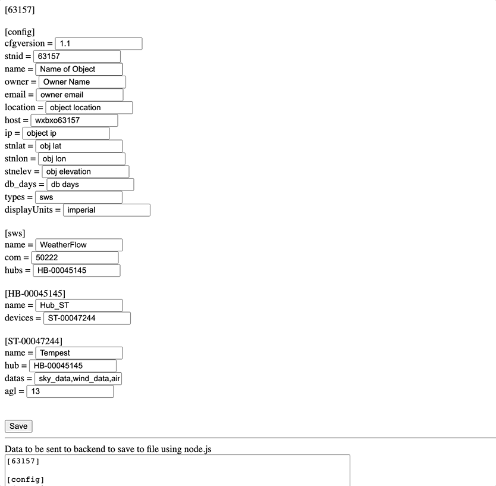

# HTML-File-Editor
Quick job for a friend.

## Requirements
1. Loads a file using only frontend processes (*CORS issue/workaround included for testing purposes)
2. No Authentication
3. Allows editor to edit values
4. Generates the new data based on user input

### Source

### Result

